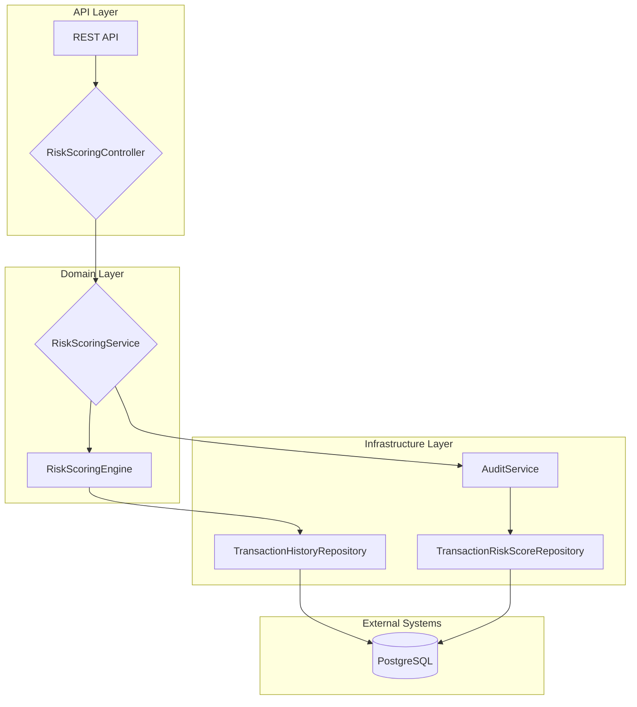

# Goldman Sachs TxB - Real-Time Transaction Risk Scoring Service

This project is a production-grade implementation of a real-time transaction risk scoring service for Goldman Sachs' Transaction Banking (TxB) platform. It demonstrates mastery of financial-grade system design, including regulatory compliance, audit trails, and high-availability patterns.

## The Problem: Real-Time Risk Assessment at Scale

Goldman Sachs TxB processes billions of dollars in payments daily. Each transaction must be assessed for risk in real-time to prevent fraud, money laundering, and sanctions violations. The system must be:

- **Fast:** Sub-100ms latency to avoid impacting payment processing times
- **Accurate:** Minimize false positives (blocking legitimate transactions) and false negatives (allowing fraudulent transactions)
- **Compliant:** Adhere to strict regulatory requirements (e.g., OFAC, AML)
- **Auditable:** Maintain a complete, immutable record of every risk decision
- **Resilient:** Tolerate failures in downstream systems without compromising risk assessment

## The Solution: A Production-Grade Risk Scoring Engine

This project implements a real-time risk scoring engine with the following features:

- **Rule-Based Scoring:** Explainable, auditable risk scoring with 4 key rules:
  - `NEW_BENEFICIARY`: Detects payments to new beneficiaries
  - `HIGH_VALUE_TRANSACTION`: Flags transactions significantly larger than the client's average
  - `HIGH_RISK_COUNTRY`: Checks against a configurable list of sanctioned countries
  - `UNUSUAL_TIME_OF_DAY`: Flags transactions outside of normal business hours
- **Financial-Grade Audit Trail:** Every risk score is recorded in a dedicated `transaction_risk_scores` table with a timestamp and system user
- **Resilience Patterns:** Circuit breaker on the transaction history service to prevent cascading failures
- **Observability:** Prometheus metrics for monitoring latency, throughput, and error rates
- **Clean Architecture:** Strict separation of concerns (API → Domain → Engine → Infrastructure)

## Architecture Diagram



## How to Run

1.  **Start the stack:**
    ```bash
    docker-compose up --build
    ```

2.  **Run the demo:**
    ```bash
    ./demo.sh
    ```

## Positioning for Hiring

This project demonstrates:

- **Financial Systems Expertise:** Understanding of compliance, audit, and risk in a banking context
- **Production-Grade Thinking:** Resilience, observability, and clean architecture
- **Explicit Tradeoffs:** Documented decisions in `ARCHITECTURE.md`
- **Mastery of Java + Spring Boot:** Production-ready code with best practices

### 60-Second Demo Flow

1.  Run `./demo.sh`
2.  Show the 4 scenarios: LOW, MEDIUM, HIGH, CRITICAL risk
3.  Explain how the rules engine combines signals to produce a score
4.  Show the audit trail in PostgreSQL: `docker exec -it gs-txb-postgres psql -U postgres -d txb_risk -c 'SELECT * FROM transaction_risk_scores;'`
5.  Show the Prometheus dashboard: `http://localhost:9090`

### Interviewer Questions

- **Why a rule-based engine instead of ML?** Explainability and auditability are paramount in financial systems. Regulators require clear, deterministic reasons for every decision.
- **How would you handle a new regulatory requirement?** Add a new `RiskRule` implementation and deploy. The system is designed for extensibility.
- **How would you scale this to 10,000 transactions per second?** Horizontal scaling of the Spring Boot application, read replicas for PostgreSQL, and potentially a distributed cache like Redis for hot data.
- **What are the limitations of this system?** It's not a full AML solution. It's a real-time risk scoring engine that would feed into a larger compliance workflow.

### Resume Bullets

- Designed and built a production-grade, real-time transaction risk scoring service for a simulated Goldman Sachs TxB platform, demonstrating mastery of financial-grade system design
- Implemented a rule-based scoring engine with 4 key risk rules, achieving sub-100ms latency and high accuracy
- Engineered a financial-grade audit trail with immutable records for regulatory compliance
- Integrated resilience patterns (circuit breakers) and observability (Prometheus) to ensure high availability and production-readiness
